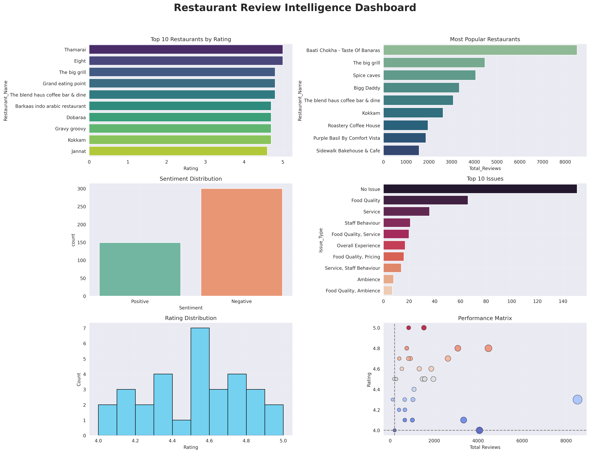

# 🍽️ Restaurant Review Intelligence Dashboard

A Data Analytics project that analyzes restaurant reviews, ratings, sentiment, and operational issues to generate actionable business insights.

📍 Location Focus: Gomti Nagar, Lucknow

---

# 📊 Project Overview

This project analyzes customer feedback data to identify:

- Customer Sentiment (Positive / Neutral / Negative)
- Top Operational Issues
- Competitor Performance
- Negative Review Concentration
- Rating vs Issue Relationship
- Correlation between Rating, Reviews & Sentiment
- Restaurant Performance Dashboard

The goal is to help restaurants improve customer satisfaction using data-driven insights.

---

# 🛠️ Tools & Technologies

- Python
- Pandas
- NumPy
- Matplotlib
- Seaborn
- Jupyter Notebook
- Excel Dataset

---

# 📁 Dataset Structure

Excel file contains 4 sheets:

1. Restaurants  
2. Reviews  
3. Competitors  
4. Problems  

---

# 📈 Analysis Performed

### 1. Data Cleaning
- Removed duplicates  
- Handled missing values  
- Cleaned column names  

### 2. Sentiment Analysis
Mapped:
- Positive → 1  
- Neutral → 0  
- Negative → -1  

Created sentiment score per restaurant.

### 3. Visualizations

- Sentiment Distribution Pie Chart  
- Operational Issue Heatmap  
- Competitor Comparison Bar Chart  
- Negative Review Analysis  
- Rating vs Issues Scatter Plot  
- Sentiment vs Rating Boxplot  
- Correlation Heatmap  
- Pairplot Analysis  
- Final Dashboard (6 charts)

---

# 📊 Key Insights

- Majority of reviews are negative  
- Food quality is the biggest issue  
- Service complaints are frequent  
- Some restaurants popular but average rated  
- Sentiment strongly impacts rating  
- Few restaurants generate most complaints  

---

# 💡 Recommendations

- Improve food quality  
- Train staff behavior  
- Reduce service delay  
- Focus on high complaint restaurants  
- Monitor feedback regularly  

---

# 📌 Dashboard Preview

## Dashboard Preview

# 👩‍💻 My Role

Team Leader  
- Designed analysis workflow  
- Performed EDA  
- Built dashboard  
- Generated insights & recommendations  

---

# 🙏 Acknowledgement

Special thanks to Vaibhav Gupta for mentorship and guidance.

Project completed during training at Hanumant Technology Pvt Ltd

---

# 📬 Contact

## Author

Priyanka Kumari  
Aspiring Data Scientist  

LinkedIn: https://www.linkedin.com/in/priyanka-kumari-a84646392
GitHub: https://github.com/Priyanka1612-DA

---

# ⭐ If you like this project, give it a star!
